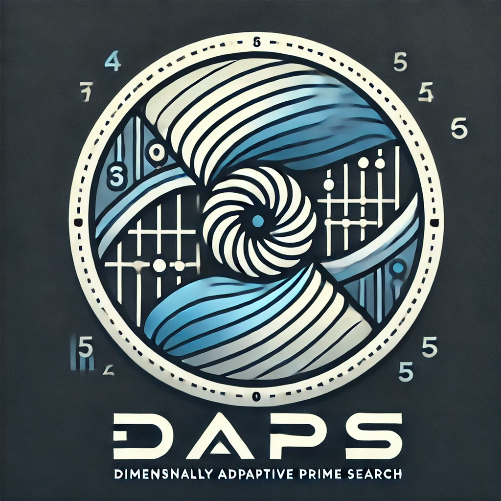

# DAPS - Dimensionally Adaptive Prime Search



A high-performance global optimization algorithm for 1D, 2D, and 3D functions, implemented in C++ with Python bindings.

## How It Works

DAPS uses prime number-based grid sampling to avoid aliasing problems common in regular grid search methods. It dynamically adapts resolution and shrinks the search domain around promising regions.
It assumes a measurable loss function at every evaluation. Primes are treated as resolution knobs and can be increased or decreased depending on the degree of accuracy needed.

For theoretical details, see the [research paper](paper/build/daps_paper.pdf).


## 🎧 DAPS Podcast Episode

Listen to the introduction of **Dimensionally Adaptive Prime Search (DAPS)** — the story, the math, and the future: [Podcast](https://github.com/sethuiyer/DAPS/blob/main/daps_podcast.mp3)

[Hacker News Thread](https://news.ycombinator.com/item?id=43451114)

## Overview

DAPS efficiently finds global minima of complex functions using a prime number-based adaptive grid search strategy. It excels at navigating complex landscapes with multiple local minima, valleys, and discontinuities.

### Key Features

- **Multi-Dimensional**: Optimize functions in 1D, 2D, or 3D spaces
- **High Performance**: C++ core with Cython bindings
- **Global Optimization**: Designed to escape local minima
- **Adaptive Resolution**: Dynamically adjusts search precision
- **SciPy Compatible**: Familiar interface for easy integration

## Quick Start

```bash
# Install from PyPI
pip install daps

# Or install from source
git clone https://github.com/sethuiyer/DAPS.git
cd DAPS
pip install -e .
```

## Basic Usage

```python
from daps import daps_minimize

# 1D Optimization Example
result = daps_minimize(
    'sphere_function',
    bounds=[-5, 5],
    options={'dimensions': 1, 'maxiter': 50}
)

print(f"Optimal solution: {result['x']}, value: {result['fun']}")
```

## Custom Functions

```python
from daps import daps_minimize, DAPSFunction
import numpy as np

# Define a custom 2D function
def himmelblau(x, y):
    return (x**2 + y - 11)**2 + (x + y**2 - 7)**2

# Wrap in a DAPSFunction with metadata
func = DAPSFunction(
    func=himmelblau,
    name="Himmelblau",
    bounds=[-5, 5, -5, 5],
    dimensions=2,
    description="Classic test function with four identical local minima"
)

# Optimize
result = daps_minimize(func, options={'maxiter': 80})
print(f"Optimal point: ({result['x'][0]:.4f}, {result['x'][1]:.4f})")
```

## ⚠️ Development Status

The pure Python implementation (`base.py`) is fully functional. C++/Cython integration and packaging are under active development.

## Interactive Demo

```bash
cd interactive
./run_demo.sh  # Linux/Mac
# or
run_demo.bat   # Windows
```

Here’s a **PyTorch‑compatible DAPS optimizer** :

- Starts at prime=97  
- Never drops below prime=2  
- Works for **n‑dimensional** functions in batch (GPU‑ready)  
- Adapts prime resolution, shrinks domain, and clamps to your original bounds  

```python
import torch
from sympy import primerange

class DAPSOptimizerTorch:
    def __init__(self, bounds, device='cpu', prime_start=97):
        primes = list(primerange(2,500))
        self.prime_list = primes
        self.prime_idx = primes.index(prime_start)
        self.min_idx = 0
        self.max_idx = len(primes)-1
        self.device = torch.device(device)
        self.bounds = torch.tensor(bounds, device=self.device).view(-1,2)

    def optimize(self, func, maxiter=10, samples=1000, shrink=0.5, tol=1e-6):
        domain = self.bounds.clone()
        best_val, best_x = float('inf'), None

        for _ in range(maxiter):
            p = self.prime_list[self.prime_idx]
            pts = domain[:,0] + (domain[:,1]-domain[:,0]) * torch.rand(samples, self.bounds.size(0), device=self.device)
            vals = func(pts).flatten()
            idx = torch.argmin(vals)
            val, x = vals[idx].item(), pts[idx]

            if val < best_val:
                best_val, best_x = val, x.clone()
                self.prime_idx = min(self.prime_idx+1, self.max_idx)
            else:
                self.prime_idx = max(self.prime_idx-1, self.min_idx)

            span = domain[:,1] - domain[:,0]
            domain[:,0] = torch.max(self.bounds[:,0], best_x - span*shrink/2)
            domain[:,1] = torch.min(self.bounds[:,1], best_x + span*shrink/2)

            if best_val < tol:
                break

        return best_x.cpu().numpy(), best_val
```

### 🔥 Usage Example

```python
import numpy as np

# 3‑D Rosenbrock as torch batch function
def rosenbrock_batch(X):
    x,y,z = X[:,0], X[:,1], X[:,2]
    return (100*(y-x**2)**2 + (1-x)**2 + 100*(z-y**2)**2).unsqueeze(1)

bounds = [-5,5, -5,5, -5,5]
opt = DAPSOptimizerTorch(bounds, device='cpu', prime_start=97)
best_point, best_val = opt.optimize(rosenbrock_batch, maxiter=20, samples=2000)
print(best_point, best_val)
```

That’s your **n‑dimensional, GPU‑ready, prime‑adaptive optimizer**.


## Citation

```bibtex
@article{iyerpreprintprime,
  title={Prime-Adaptive Search (PAS): A Novel Method for Efficient Optimization in Discontinuous Landscapes},
  author={Iyer, Sethu},
  year={2025},
  url={https://github.com/sethuiyer/DAPS},
}
```

## License

MIT License - See LICENSE file for details.
